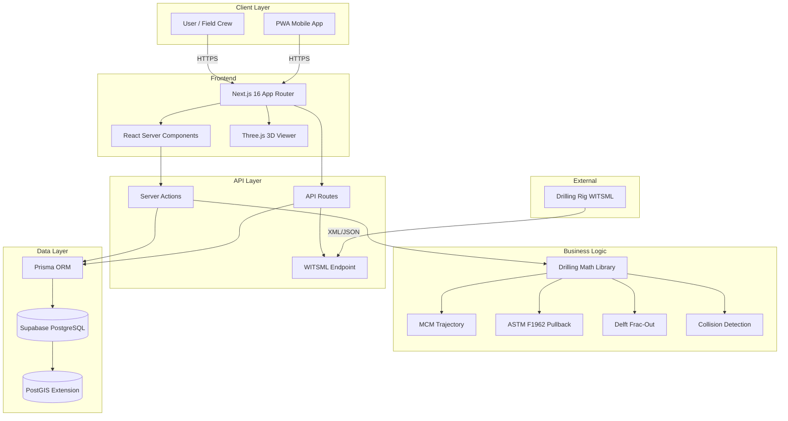
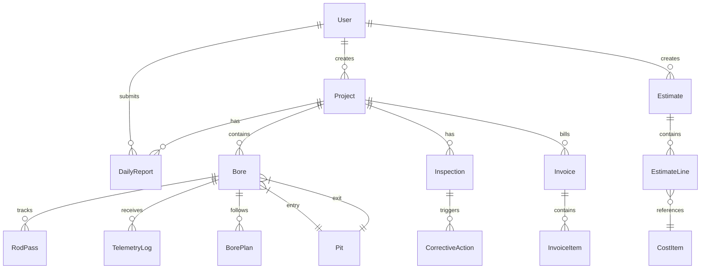

# Phase 1: Codebase Understanding
**Audit Date:** December 1, 2025
**Project:** HDD-Nexus (Midwest Underground)

---

## Executive Summary

HDD-Nexus is a comprehensive SaaS platform for **Horizontal Directional Drilling (HDD)** operations. It combines high-performance engineering calculations with modern field management capabilities, designed to bridge the gap between office planning and field execution.

**Overall Status:** 93.5% feature complete, active development
**Production Readiness:** Blocked by critical security vulnerabilities

---

## Tech Stack

| Component | Technology | Version |
|-----------|------------|---------|
| **Frontend** | Next.js (App Router) | 16.0.5 |
| **UI Framework** | React | 19.2.0 |
| **Styling** | Tailwind CSS + Radix UI | 4.x |
| **Language** | TypeScript | 5.x |
| **Database** | Supabase (PostgreSQL + PostGIS) | - |
| **ORM** | Prisma | 6.19.0 |
| **Authentication** | NextAuth.js | 4.24.13 |
| **3D Visualization** | React Three Fiber + Three.js | 9.4.2 / 0.181.2 |
| **Charts** | Chart.js + Recharts | 4.5.1 / 3.5.1 |
| **Testing** | Vitest | 4.0.14 |

---

## Architecture Diagram



---

## Directory Structure

```
C:\Users\Owner\Desktop\MU\
├── src/
│   ├── app/                      # Next.js App Router
│   │   ├── (marketing)/          # Public pages (route group)
│   │   ├── api/                  # API routes
│   │   │   ├── auth/             # NextAuth endpoints
│   │   │   ├── feedback/         # Bug reporting
│   │   │   └── witsml/           # WITSML data ingestion
│   │   ├── auth/                 # Auth pages
│   │   └── dashboard/            # Protected dashboard pages
│   ├── actions/                  # Server actions (root level)
│   ├── components/               # React components
│   │   ├── ui/                   # Shadcn/ui components
│   │   ├── drilling/             # Drilling-specific components
│   │   ├── landing/              # Marketing page components
│   │   └── [feature]/            # Feature-specific components
│   ├── lib/                      # Core utilities
│   │   ├── drilling/             # Drilling calculations
│   │   │   ├── math/             # MCM, loads, hydraulics
│   │   │   ├── witsml/           # WITSML parsing
│   │   │   └── types.ts          # Type definitions
│   │   ├── auth.ts               # NextAuth configuration
│   │   └── prisma.ts             # Database client
│   └── types/                    # TypeScript definitions
├── prisma/
│   ├── schema.prisma             # Database schema (38 models)
│   └── seed.ts                   # Development seed data
├── public/
│   └── dashboard/                # Static dashboard assets
├── docs/                         # Documentation
└── AUDIT-NOTES/                  # Audit documentation
```

---

## Core Modules

### 1. Drilling Operations (Primary Business Logic)

**Location:** `src/lib/drilling/math/`

| Module | File | Purpose | Industry Standard |
|--------|------|---------|-------------------|
| **Trajectory** | `mcm.ts` | Minimum Curvature Method for 3D bore path | MCM Algorithm |
| **Pullback** | `loads.ts` | Pipe installation force calculations | ASTM F1962 |
| **Hydraulics** | `hydraulics.ts` | Frac-out risk analysis | Delft Model |
| **Collision** | `collision.ts` | Utility proximity detection | Custom |
| **Geodesy** | `geodesy.ts` | Coordinate transformations | proj4 |

### 2. Dashboard Routes

| Route | Purpose | Status |
|-------|---------|--------|
| `/dashboard` | Home/overview | Complete |
| `/dashboard/projects` | Project list | Complete |
| `/dashboard/projects/[id]` | Project detail | Complete |
| `/dashboard/projects/[id]/live` | Real-time telemetry | Complete |
| `/dashboard/projects/[id]/3d` | 3D visualization | Complete |
| `/dashboard/reports` | Daily reports | Complete |
| `/dashboard/estimating` | Estimates/bidding | Complete |
| `/dashboard/assets` | Asset management | Complete |
| `/dashboard/crew` | Crew management | Complete |
| `/dashboard/settings` | Admin settings | Complete |

### 3. API Endpoints

| Endpoint | Method | Purpose |
|----------|--------|---------|
| `/api/auth/[...nextauth]` | GET/POST | Authentication |
| `/api/witsml` | POST | WITSML data ingestion |
| `/api/witsml/latest` | GET | Latest telemetry |
| `/api/witsml/logs` | GET | Telemetry history |
| `/api/witsml/stream` | GET | SSE streaming |
| `/api/feedback` | POST | Bug reports |

---

## Database Schema Overview

**Total Models:** 38
**Key Entities:**



---

## Data Flow Patterns

### Rod Pass Logging Flow
```
1. Field operator logs rod pass via RodPassForm
2. Server action validates and calculates trajectory
3. MCM algorithm computes new 3D position
4. Collision detection checks against obstacles
5. Data persisted via Prisma
6. UI updates: 3D view, steering gauge, profile
```

### Real-Time Telemetry Flow
```
1. Drilling rig sends WITSML XML/JSON
2. POST /api/witsml receives and validates
3. Parser extracts: Depth, Pitch, Azimuth
4. TelemetryLog stored in database
5. SSE pushes updates to LiveTelemetry component
6. Charts and gauges update in real-time
```

---

## Role-Based Access Control

| Role | Access Level | Capabilities |
|------|--------------|--------------|
| **OWNER** | Full | All features, settings, financial data |
| **SUPER** | Administrative | All except system settings |
| **FOREMAN** | Field Lead | Reports, inspections, safety |
| **OPERATOR** | Field | Rod logging, daily reports |
| **LABORER** | Basic | View-only, limited input |
| **CREW** | Default | Basic access |

---

## Key Features Identified

### Implemented (93.5%)
- Project management lifecycle
- Real-time drilling telemetry
- 3D bore visualization (Three.js)
- ASTM F1962 pullback calculations
- Delft frac-out analysis
- Daily report workflow with approvals
- Estimating and bidding
- Invoice generation (AIA G702/G703)
- Asset and equipment tracking
- Crew and time card management
- Safety meeting documentation
- QC inspections and punch lists
- WITSML data ingestion

### Planned (6.5%)
- Cost database integration
- Cost calculation engine
- Advanced reporting/analytics

---

## Dependencies Analysis

**Production Dependencies:** 43 packages
**Dev Dependencies:** 15 packages
**Vulnerability Status:** 0 vulnerabilities (npm audit)

### Critical Dependencies
| Package | Version | Purpose | Risk |
|---------|---------|---------|------|
| next | 16.0.5 | Framework | Low |
| react | 19.2.0 | UI | Low |
| prisma | 6.19.0 | ORM | Low |
| next-auth | 4.24.13 | Auth | Medium (config-dependent) |
| three | 0.181.2 | 3D | Low |
| fast-xml-parser | 5.3.2 | WITSML parsing | Medium (XXE risk) |
| bcryptjs | 3.0.3 | Password hashing | Low |

---

## Build Configuration

**Development:** `npm run dev` (Turbo mode enabled)
**Production Build:** `npm run build --webpack`
**PWA Support:** Enabled via `@ducanh2912/next-pwa`

---

## Entry Points

1. **Landing Page:** `/` - Marketing site
2. **Login:** `/login` - Credential authentication
3. **Dashboard:** `/dashboard` - Main application
4. **API:** `/api/*` - Backend services

---

## Findings Summary

### Strengths
- Well-organized modular architecture
- Comprehensive drilling calculation library
- Industry-standard algorithms (MCM, ASTM, Delft)
- Modern tech stack with TypeScript
- Good separation of concerns

### Concerns
- Security vulnerabilities (see Phase 2)
- Some test failures (WITSML parser)
- Missing authorization checks
- JSON fields in database limit querying

---

**Next Phase:** Code Quality Analysis (02-code-quality.md)
