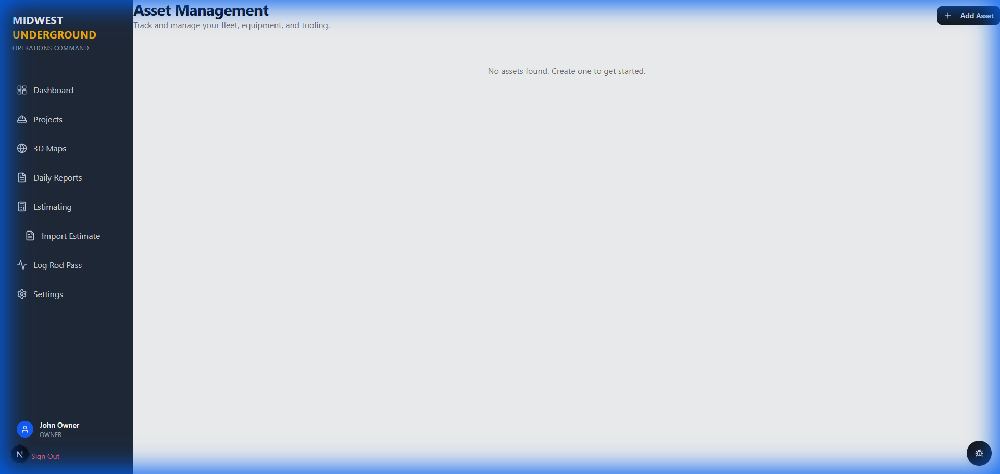
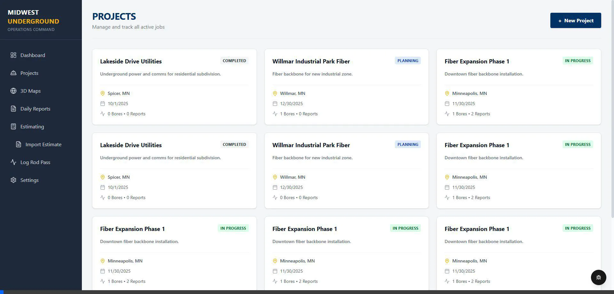
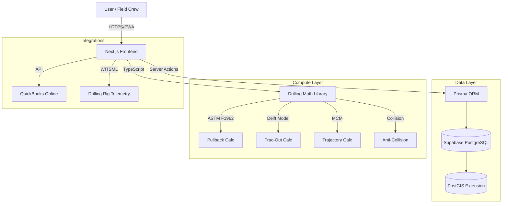
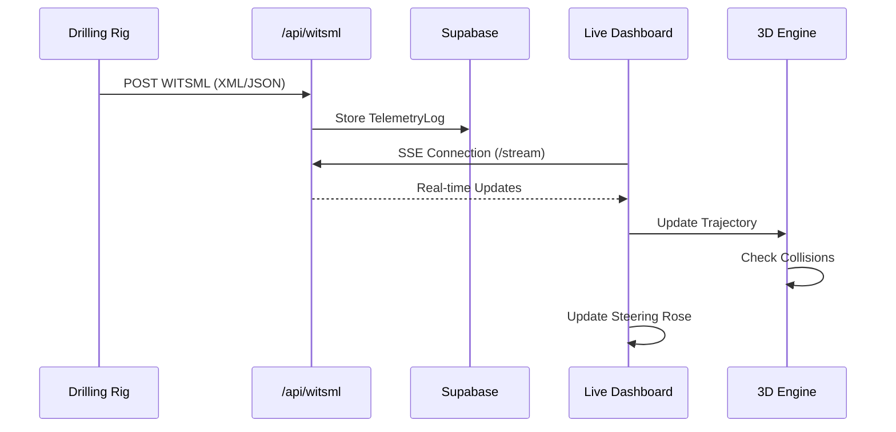

# HDD-Nexus: Digital Subsurface Platform

> **Status**: 🚀 Active Development | **Mode**: Turbo ⚡ | **Stack**: Next.js + TypeScript + Supabase

A comprehensive SaaS platform for **Horizontal Directional Drilling (HDD)** operations, combining high-performance engineering with modern field management. Designed to bridge the gap between office planning and field execution.

---

## 📸 Visual Overview

### Asset Management
*Track rigs, locators, and support equipment with real-time status.*


### Live Dashboard Tour
*Interactive tour of the project dashboard and linear progress tracking.*


### Landing Page
*Public facing portal for stakeholders.*


---

## 🏗 Architecture



### 📡 WITSML Data Flow



---

## 🚀 Key Features

### 1. 🚜 Asset Management
- **Fleet Tracking**: Manage Drills, Excavators, Trucks, and Locators.
- **Maintenance**: Schedule and track equipment maintenance.
- **Usage Logs**: Track hours and utilization by project.

### 2. 📈 Production & Engineering
- **Digital Bore Logs**: Real-time rod-by-rod logging.
- **As-Built Generation**: Automated profile views and PDF exports.
- **Physics Engine**: ASTM F1962 Pullback & Delft Frac-Out modeling.
- **Rod Planner**: Integrated trajectory planning.

### 3. 💰 Financials
- **Estimating**: Create professional bids with labor, equipment, and material line items.
- **Job Costing**: Real-time profitability tracking (Budget vs Actual).
- **Invoicing**: AIA-style progress billing (G702/G703) with retainage.
- **Payroll**: Employee management with QuickBooks-compatible fields (SSN, Tax Status).

### 4. 👷 Field Operations
- **Crew Management**: Employee directory and digital time cards.
- **Safety**: Toolbox Talks (signatures), JSAs, and Vehicle Inspections.
- **Quality Control**: Punch Lists and Photo Gallery.

### 5. 🌍 Digital Subsurface
- **3D Visualization**: Interactive view of bore paths and soil layers.
- **Geotech Integration**: Manage soil borings and stratigraphy.
- **Collision Detection**: Real-time alerts for utility proximity.
- **Robust 3D Engine**: WebGL context loss handling and auto-recovery.

### 6. 📡 Live Operations
- **Real-Time Telemetry**: Ingest WITSML data streams.
- **Live Dashboard**: "Tactical Dashboard" with High Contrast Day Mode.
- **Steering Rose**: Modernized UI with traffic light deviation alerts.

### 7. ⚙️ System Administration
- **Role-Based Access**: Admin, Foreman, and Crew roles.
- **Integrations**: QuickBooks Online configuration.
- **Preferences**: System-wide dark mode and notification settings.

---

## 🛠 Tech Stack

| Component | Technology | Description |
|-----------|------------|-------------|
| **Frontend** | Next.js 16 | App Router, Server Actions, React Server Components |
| **UI** | Tailwind + Shadcn | Modern, responsive, accessible components |
| **Logic** | TypeScript | Core drilling math and physics (migrated from Rust for velocity) |
| **Database** | Supabase | Cloud-hosted PostgreSQL with PostGIS |
| **ORM** | Prisma | Type-safe database access |
| **3D** | Three.js + R3F | High-performance WebGL visualization |

---

## 🏁 Getting Started

1.  **Install Dependencies**: `npm install`
2.  **Configure Environment**: Ensure `.env` has valid Supabase credentials.
3.  **Sync Database**: `npx prisma db push`
4.  **Run Dev Server**: `npm run dev`

## ⚡ Low-Spec Development Mode

For systems with limited RAM (e.g., 16GB), use the optimized startup script:

```powershell
./scripts/dev_low_spec.ps1
```

---

## 📂 Documentation Index

- [Audit Plan](./docs/audit_plan.md) - Current documentation status.
- [Handoff Report](./docs/handoff.md) - Summary of previous session.
- [Presentation](./docs/presentation.md) - Project overview slides.
- [_archive/](./_archive/) - Archived documentation.

---

*Built with ❤️ by Antigravity in Turbo Mode*
