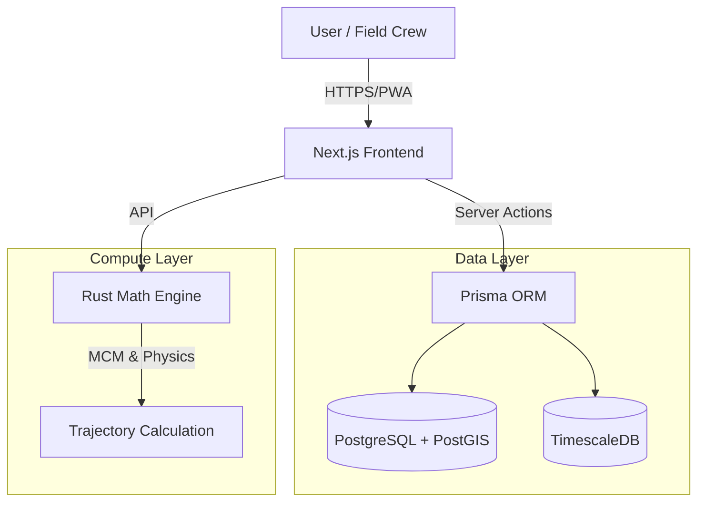
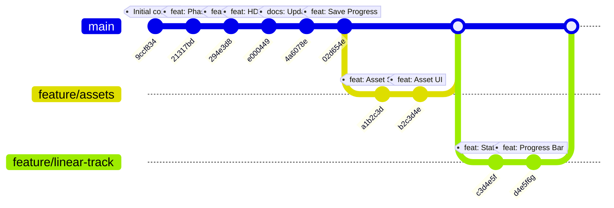

# HDD-Nexus: Digital Subsurface Platform

> **Status**: 🚀 Active Development | **Mode**: Turbo ⚡ | **Stack**: Next.js + Rust + PostGIS

A comprehensive SaaS platform for **Horizontal Directional Drilling (HDD)** operations, combining high-performance engineering with modern field management. Designed to bridge the gap between office planning and field execution.

---

## 📸 Visual Overview

### Asset Management
*Track rigs, locators, and support equipment with real-time status.*

### Live Dashboard Tour
*Interactive tour of the project dashboard and linear progress tracking.*

### Landing Page
*Public facing portal for stakeholders.*

### Linear Progress Tracking
*Visualize bore progress by station (footage) directly on the project dashboard.*
*(See Dashboard Tour above)*

---

## 🏗 Architecture

---

## 📜 Development History (Cinematic)

*Generated using custom Rust tool `git_viz.rs`*

---

## 🚀 Key Features

### 1. 🚜 Asset Management (New!)
- **Fleet Tracking**: Manage Drills, Excavators, Trucks, and Locators.
- **Status Monitoring**: Real-time status (Available, In Use, Maintenance).
- **Project Assignment**: Assign assets to specific job sites.

### 2. 📈 Linear Progress Tracking (New!)
- **Station-Based**: Track progress by footage (e.g., "Station 100 to 250").
- **Activity Logging**: Log specific activities (Pilot, Ream, Pullback).
- **Visual Dashboard**: Progress bars and completion stats per project.

### 3. 🧮 Core Engineering (Rust Engine)
- **Physics Engine**: ASTM F1962 Pullback & Hydraulic Fracture modeling.
- **Geometry**: Minimum Curvature Method (MCM) for precise 3D path calculations.
- **Performance**: Rust-based backend (`/engine`) exposed via Axum API.

### 4. 🌍 Digital Subsurface
- **3D Visualization**: Interactive view of bore paths and soil layers.
- **Geotech Integration**: Manage soil borings and stratigraphy.

### 5. 📡 Live Operations
- **Telemetry**: Ingest WITSML data from rigs.
- **Live Dashboard**: Real-time monitoring of depth, pitch, and azimuth.

---

## 🛠 Tech Stack

| Component | Technology | Description |
|-----------|------------|-------------|
| **Frontend** | Next.js 16 | App Router, Server Actions, React Server Components |
| **UI** | Tailwind + Shadcn | Modern, responsive, accessible components |
| **Backend** | Rust (Axum) | High-performance math and physics calculations |
| **Database** | PostgreSQL 16 | With PostGIS (Spatial) and TimescaleDB (Time-series) |
| **ORM** | Prisma | Type-safe database access |
| **DevOps** | Docker | Containerized development and deployment |

---

## 🏁 Getting Started

1.  **Start Infrastructure**: `docker-compose up -d`
2.  **Install Dependencies**: `npm install`
3.  **Sync Database**: `npx prisma db push`
4.  **Run Dev Server**: `npm run dev`
5.  **Run Rust Engine**: `cd engine && cargo run`

---

## 📂 Documentation Index

- [Implementation Plan](./docs/implementation_plan.md) - Recent feature specs.
- [Walkthrough](./docs/walkthrough.md) - Verification steps for new features.
- [Handoff Report](./docs/handoff.md) - Summary of previous session.
- [Task List](./docs/task.md) - Current roadmap.
- [Presentation](./docs/presentation.md) - Project overview slides.

---

*Built with ❤️ by Antigravity in Turbo Mode*
