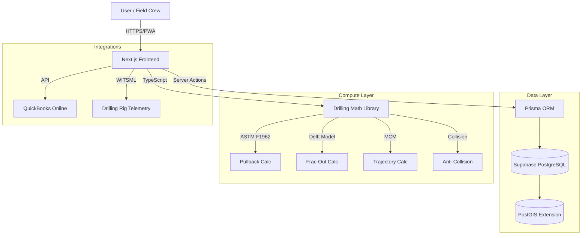
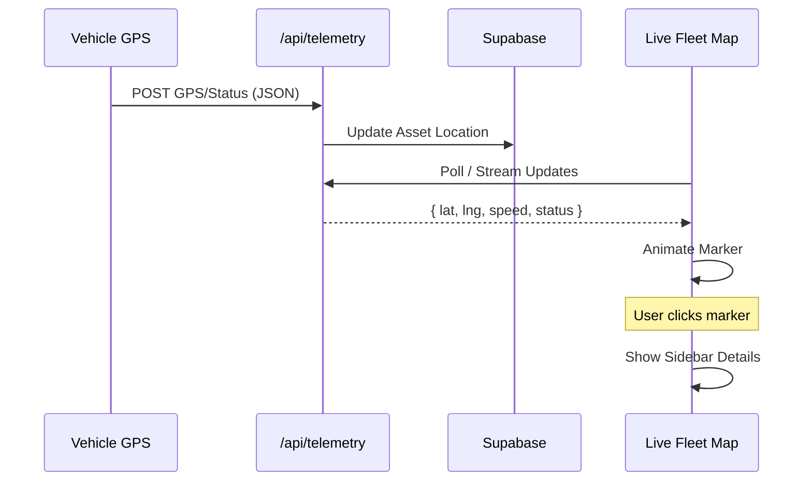

# HDD-Nexus: Digital Subsurface Platform

> **Status**: 🚀 Active Development | **Mode**: Turbo ⚡ | **Stack**: Next.js + TypeScript + Supabase

**The Operating System for Horizontal Directional Drilling.**

HDD-Nexus bridges the gap between precision engineering and rugged field execution. It is a comprehensive SaaS platform that transforms how drilling contractors plan, execute, and track their operations—from the bid to the final bore log.

---

## 📸 Visual Overview

### 🌍 Live Fleet Command
*Real-time satellite tracking of all assets with interactive status and telemetry.*


### 🏗️ 3D Digital Twin
*Interactive subsurface visualization with soil layers, bore paths, and utility crossings.*


### 📊 Tactical Dashboard
*Centralized control center for project management, dispatch, and financial performance.*


---

## 🏗 Architecture & Data Flow

### System Architecture


### 📡 Live Fleet Tracking Flow


---

## 🚀 Key Features

### 1. 🌍 Live Operations Command
- **Fleet Tracking**: Real-time satellite map of all vehicles and equipment.
- **Interactive Telemetry**: Click any asset to view speed, heading, fuel, and assigned crew.
- **Status Monitoring**: Visual indicators for Moving, Working, and Stopped assets.
- **Tactical Dashboard**: High-contrast "Day Mode" for field visibility.

### 2. 🏗️ 3D Digital Twin
- **Subsurface Visualization**: Render bore paths, soil layers, and obstacles in a fully interactive 3D environment.
- **Demo Mode**: One-click simulation of complex drilling scenarios (Urban, River Crossing, Rock).
- **Collision Avoidance**: Visual indicators for proximity to gas, water, and fiber lines.

### 3. 💰 Financial Intelligence
- **Smart Estimating**: Build bids using "Kits" (e.g., 100' Bore Kit) and live inventory pricing.
- **Job Costing**: Real-time "Budget vs Actual" tracking.
- **AIA Invoicing**: Generate G702/G703 style progress billings.
- **QuickBooks Integration**: Seamless sync of employees and payroll data.

### 4. 👷 Field & Crew Management
- **Smart Dispatch**: Drag-and-drop assignment of crews and equipment to projects.
- **Mobile Time Cards**: GPS-verified clock-ins for field staff.
- **Safety Compliance**: Digital Toolbox Talks, JSAs, and Vehicle Inspections (DVIR).
- **Quality Control**: Punch lists and photo documentation directly from the field.

### 5. 📉 Engineering & Planning
- **Rod-by-Rod Planning**: Design trajectories with precise pitch and depth targets.
- **Physics Engine**: Automated ASTM F1962 Pullback and Frac-Out calculations.
- **As-Built Generation**: One-click generation of professional profile views and bore logs.

---

## 🛠 Tech Stack

| Component | Technology | Description |
|-----------|------------|-------------|
| **Frontend** | Next.js 16 | App Router, Server Actions, React Server Components |
| **UI** | Tailwind + Shadcn | Modern, responsive, accessible components |
| **Logic** | TypeScript | Core drilling math and physics (migrated from Rust for velocity) |
| **Database** | Supabase | Cloud-hosted PostgreSQL with PostGIS |
| **ORM** | Prisma | Type-safe database access |
| **3D** | Three.js + R3F | High-performance WebGL visualization |

---

## 🏁 Getting Started

1.  **Install Dependencies**: `npm install`
2.  **Configure Environment**: Ensure `.env` has valid Supabase credentials.
3.  **Sync Database**: `npx prisma db push`
4.  **Seed Data**: `npx prisma db seed` (Populates demo data)
5.  **Run Dev Server**: `npm run dev`

## ⚡ Low-Spec Development Mode

For systems with limited RAM (e.g., 16GB), use the optimized startup script:

```powershell
./scripts/dev_low_spec.ps1
```

---

## 📂 Documentation Index

- [Architecture](./docs/architecture.md) - System design and tech stack.
- [Decisions](./docs/decisions.md) - Architectural decision records (ADR).
- [Audit Plan](./docs/audit_plan.md) - Current documentation status.
- [Handoff Report](./docs/handoff.md) - Summary of previous session.
- [Presentation](./docs/presentation.md) - Project overview slides.
- [_archive/](./_archive/) - Archived documentation.

---

*Built with ❤️ by Antigravity in Turbo Mode*
