# Midwest Underground (MU) | Digital Operations Platform


> **The Operating System for Horizontal Directional Drilling (HDD).**

Midwest Underground (MU) is a comprehensive, offline-first digital platform designed to modernize the HDD industry. It replaces fragmented paper processes, spreadsheets, and whiteboard tracking with a unified, real-time command center. From field data collection to financial analytics, MU bridges the gap between the muddy boots on the ground and the decisions in the office.

---

## 🚀 Key Features

### 🏗️ Field Operations
- **Offline-First Daily Reports**: Crews can log labor, equipment, and production data without internet access. Data syncs automatically when connectivity returns.
- **Digital Ticketing**: Integrated 811/OneCall ticket management with GPS-verified locate tracking.
- **Drill Log Telemetry**: Shot-by-shot bore logging (Pitch, Azimuth, Depth) with real-time collision avoidance.

### 💼 Financial Intelligence
- **Job Costing**: Real-time tracking of estimated vs. actual costs for labor, materials, and equipment.
- **Accurate Payroll**: Automated time card generation with Double Time logic and RBAC protection for sensitive rates.
- **Asset Management**: GPS tracking and maintenance logs for yellow iron and fleet vehicles.

### 🛡️ Quality & Compliance
- **216D Compliance**: Automated workflows for state-mandated utility damage prevention (Visual verification, White-lining).
- **Safety**: Integrated JSA (Job Safety Analysis) and incident reporting.
- **QC Punch Lists**: Photo-verified quality control inspections and resolution tracking.

### 📊 Executive Analytics
- **Live Command Center**: Real-time map view of all active crews and rigs.
- **Production Metrics**: Drill rates per rig, utility strike frequency, and bid accuracy analysis.
- **Cost Coding**: Granular tracking of labor and equipment usage against specific cost codes for precise P&L.

---

## 🏗️ System Architecture

MU is built on a modern "Fortress" architecture designed for security, reliability, and offline capability.

```mermaid
graph TD
    subgraph "Field (Client-Side)"
        PWA[Progressive Web App]
        PWA -->|Offline Queue| IDB[(IndexedDB)]
        PWA -->|Action| ServerActions[Server Actions]
    end

    subgraph "Cloud (Servererless)"
        ServerActions -->|Auth / Validation| Fortress[Fortress Security Layer]
        Fortress -->|ORM| Prisma[Prisma Client]
        Prisma -->|Query| DB[(PostgreSQL)]
        
        API[API Routes] -->|Ingest| TelemetryService[Telemetry Service]
        TelemetryService --> DB
    end

    subgraph "External Integrations"
        DB --- S3[Object Storage (Photos)]
        DB --- Mapbox[Mapping Services]
        DB --- QB[QuickBooks Online]
    end

    classDef client fill:#e1f5fe,stroke:#01579b
    classDef server fill:#f3e5f5,stroke:#4a148c
    classDef db fill:#e8f5e9,stroke:#1b5e20
    
    class PWA,IDB client
    class ServerActions,Fortress,Prisma,API,TelemetryService server
    class DB,S3,Mapbox,QB db
```

---

## 🗄️ Data Model (Simplified)

The core data structure revolves around the **Project**, which acts as the container for all operational data.


---

## 🔄 User Journey: The Daily Report

The "Daily Report" is the heartbeat of MU, feeding payroll, billing, and progress tracking in a single flow.

```mermaid
sequenceDiagram
    participant Foreman as 👷 Foreman
    participant App as 📱 MU App
    participant Cloud as ☁️ Server
    participant Super as 👨‍💼 Superintendent

    Foreman->>App: Creates Daily Report
    Foreman->>App: Adds Crew & Hours
    Foreman->>App: Logs Production (Bore Footage)
    Foreman->>App: Takes Site Photos
    Foreman->>App: Signs & Submits
    
    rect rgb(240, 248, 255)
        Note right of Foreman: If Offline, data saves locally
    end
    
    App->>Cloud: Sync Data (Fortress Validated)
    Cloud->>Cloud: Calculate Costs & Payroll
    Cloud->>Super: Notify "Report Pending"
    
    Super->>Cloud: Reviews Report
    Super->>Cloud: Approves Report
    
    Cloud->>Cloud: Update Project Budget
    Cloud->>Cloud: Finalize Time Cards
```



---

## 🛠️ Technology Stack

| Component | Technology | Rationale |
|-----------|------------|-----------|
| **Framework** | Next.js 15 (App Router) | Server Components for performance, robust routing. |
| **Language** | TypeScript | Strict type safety across the entire stack. |
| **Database** | PostgreSQL | Relational integrity for complex financial data. |
| **ORM** | Prisma | Implementation speed and type-safe database access. |
| **Styling** | Tailwind CSS | Rapid UI development with a consistent design system. |
| **State** | React Query / Zustand | Efficient server-state management. |
| **Maps** | Mapbox GL JS | High-performance vector mapping for bore paths. |
| **Simulation** | Rust/WASM (Subterra) | High-performance physics for drilling simulation. |

---

## 🚀 Getting Started

1.  **Clone the Repository**
    ```bash
    git clone https://github.com/nice-and-precise/MU.git
    cd MU
    ```

2.  **Install Dependencies**
    ```bash
    npm install
    ```

3.  **Environment Setup**
    Create a `.env` file based on `.env.example`.
    ```env
    DATABASE_URL="postgresql://..."
    DIRECT_URL="postgresql://..."
    ```

4.  **Database Migration**
    ```bash
    npx prisma generate
    npx prisma db push
    ```

5.  **Run Development Server**
    ```bash
    npm run dev
    ```

---

## 📄 License

Proprietary Software - All Rights Reserved.
Midwest Underground 2025.
