# Midwest Underground (MU) | Digital Operations Platform


> **The Operating System for Horizontal Directional Drilling (HDD).**
> *See [Pilot Demo Open Items & Limitations](docs/demo-open-items.md) for current status.*

Midwest Underground (MU) is a comprehensive, offline-first digital platform designed to modernize the HDD industry. It replaces fragmented paper processes, spreadsheets, and whiteboard tracking with a unified, real-time command center. From field data collection to financial analytics, MU bridges the gap between the muddy boots on the ground and the decisions in the office.

---

## 🚀 Key Features

### 🏗️ Field Operations
- **Offline-First Daily Reports**: Crews can log labor, equipment, and production data without internet access. Data syncs automatically when connectivity returns.
- **Mobile Companion (PWA)**: Installable on iPad/Android tablets for seamless field data entry.
- **Digital Ticketing**: Integrated 811/OneCall ticket management with GPS-verified locate tracking.

### 💼 Financial Intelligence
- **Job Costing**: Real-time tracking of estimated vs. actual costs for labor, materials, and equipment.
- **Command Center**: "Revenue Health" monitoring with live Inventory Value and Active Fleet counts.
- **Automated Closeout**: Structured workflow to archive projects only when all punch items are resolved.

### 🛡️ Quality & Compliance
- **216D Compliance**: Automated workflows for state-mandated utility damage prevention.
- **QC Punch Lists**: Photo-verified quality control inspections and resolution tracking.
- **Safety**: Integrated JSA (Job Safety Analysis) and incident reporting.

### 📊 Executive Analytics
- **Live Command Center**: Real-time map view of all active crews and rigs.
- **Production Metrics**: Drill rates per rig, utility strike frequency, and bid accuracy analysis.

---

## 🏗️ System Architecture

MU is built on a modern "Fortress" architecture designed for security, reliability, and offline capability.

```mermaid
graph TD
    subgraph "Field (Client-Side)"
        PWA[Progressive Web App]
        PWA -->|Offline Queue| IDB[(IndexedDB)]
        PWA -->|Action| ServerActions[Server Actions]
    end

    subgraph "Cloud (Serverless)"
        ServerActions -->|Auth / Validation| Fortress[Fortress Security Layer]
        Fortress -->|ORM| Prisma[Prisma Client]
        Prisma -->|Query| DB[(PostgreSQL)]
        
        API[API Routes] -->|Ingest| TelemetryService[Telemetry Service]
        TelemetryService --> DB
    end

    subgraph "External Integrations"
        DB --- S3[Object Storage (Photos)]
        DB --- Mapbox[Mapping Services]
        DB --- QB[QuickBooks Online]
    end

    classDef client fill:#e1f5fe,stroke:#01579b
    classDef server fill:#f3e5f5,stroke:#4a148c
    classDef db fill:#e8f5e9,stroke:#1b5e20
    
    class PWA,IDB client
    class ServerActions,Fortress,Prisma,API,TelemetryService server
    class DB,S3,Mapbox,QB db
```

---

## 🗄️ Data Model (Simplified)

The core data structure revolves around the **Project**, which acts as the container for all operational data.


---

## 🔄 User Journey: The Project Lifecycle

From bidding to archiving, MU manages the entire lifecycle.

```mermaid
sequenceDiagram
    participant Sales as 💼 Sales
    participant Ops as 🏗️ Ops
    participant Field as 👷 Field
    participant System as 🖥️ MU Core

    Sales->>System: Create Project (Planning)
    System->>Ops: Notify New Job
    Ops->>System: Assign Crew & Assets (Active)
    
    Note over Field: Field Operations Begin
    
    loop Daily
        Field->>System: Submit Daily Report
        System->>System: Update Cost & Schedule
    end
    
    Field->>System: Complete Punch List
    Ops->>System: Review & Archive Project
    System->>System: Closeout Financials
```



---

## 🛠️ Technology Stack

| Component | Technology | Rationale |
|-----------|------------|-----------|
| **Framework** | Next.js 15 (App Router) | Server Components for performance, robust routing. |
| **Language** | TypeScript | Strict type safety across the entire stack. |
| **Database** | PostgreSQL | Relational integrity for complex financial data. |
| **ORM** | Prisma | Implementation speed and type-safe database access. |
| **Styling** | Tailwind CSS | Rapid UI development with a consistent design system. |
| **State** | React Query / Zustand | Efficient server-state management. |
| **Maps** | Mapbox GL JS | High-performance vector mapping for bore paths. |

---

## 🚀 Getting Started

1.  **Clone the Repository**
    ```bash
    git clone https://github.com/nice-and-precise/MU.git
    cd MU
    ```

2.  **Install Dependencies**
    ```bash
    npm install
    ```

3.  **Environment Setup**
    Create a `.env` file based on `.env.example`.
    ```env
    DATABASE_URL="postgresql://..."
    DIRECT_URL="postgresql://..."
    ```

4.  **Database Migration**
    ```bash
    npx prisma generate
    npx prisma db push
    ```

6.  **Demo Data Seeding**
    The system includes a robust demo data generator that populates realistic users, projects, 811 tickets, and financial data.

    **Local Developer Flow:**
    ```bash
    # Seed full demo data
    npx prisma db seed

    # Verify data integrity
    npx ts-node scripts/verify-demo-data.ts
    ```

    **Hosted / Production Flow:**
    -   Log in as an OWNER or SUPER user.
    -   Go to the Owner Dashboard.
    -   Click the **"Seed Demo System"** button in the top header.
    -   *Note: This action is idempotent and safe to run multiple times.*

5.  **Run Development Server**
    ```bash
    npm run dev
    ```

---

## 📄 License

Proprietary Software - All Rights Reserved.
Midwest Underground 2025.
