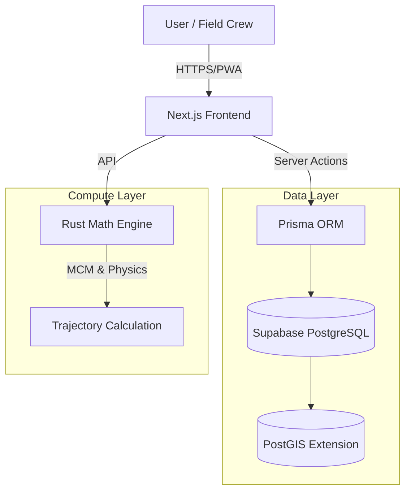
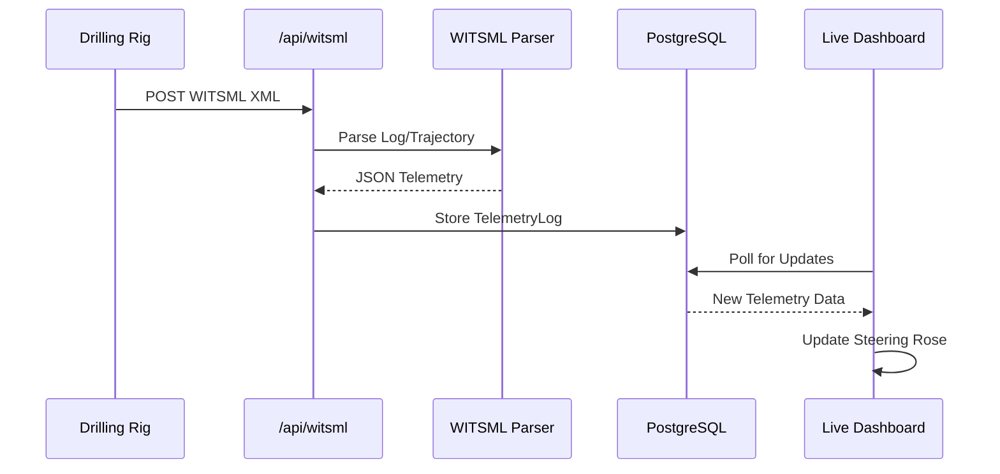
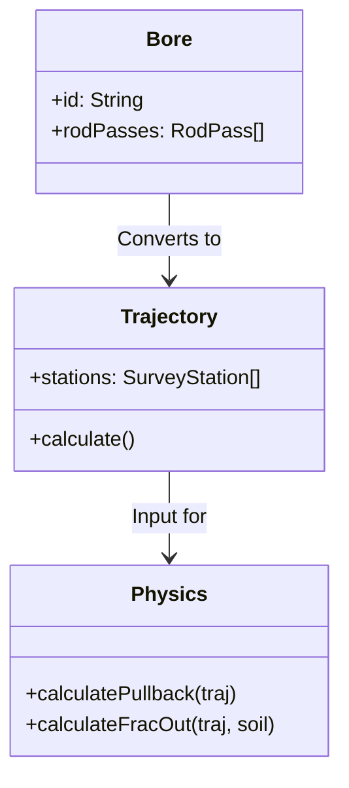

# HDD-Nexus: Digital Subsurface Platform

> **Status**: 🚀 Active Development | **Mode**: Turbo ⚡ | **Stack**: Next.js + Rust + PostGIS

A comprehensive SaaS platform for **Horizontal Directional Drilling (HDD)** operations, combining high-performance engineering with modern field management. Designed to bridge the gap between office planning and field execution.

---

## 📸 Visual Overview

### Asset Management
*Track rigs, locators, and support equipment with real-time status.*


### Live Dashboard Tour
*Interactive tour of the project dashboard and linear progress tracking.*


### Landing Page
*Public facing portal for stakeholders.*


### Linear Progress Tracking
*Visualize bore progress by station (footage) directly on the project dashboard.*
*(See Dashboard Tour above)*

---

## 🏗 Architecture



### 📡 WITSML Data Flow



### 🧮 Physics Engine Logic



---

## 📜 Development History (Cinematic)

*Generated using custom Rust tool `git_viz.rs`*


---

## 🚀 Key Features

### 1. 🚜 Asset Management (New!)
- **Fleet Tracking**: Manage Drills, Excavators, Trucks, and Locators.
- **Status Monitoring**: Real-time status (Available, In Use, Maintenance).
- **Project Assignment**: Assign assets to specific job sites.

### 2. 📈 Linear Progress Tracking (New!)
- **Station-Based**: Track progress by footage (e.g., "Station 100 to 250").
- **Activity Logging**: Log specific activities (Pilot, Ream, Pullback).
- **Visual Dashboard**: Progress bars and completion stats per project.

### 3. 🧮 Core Engineering (Physics Engine)
- **Pullback Force**: ASTM F1962 with Capstan Effect (Friction at bends).
- **Hydraulics**: Delft Cavity Expansion Model for Frac-Out Prediction (P_max).
- **Magnetic Compensation**: True Azimuth calculation with Declination and Interference scaling.
- **Rod Planner**: Integrated physics-based planning tool.

### 4. 🌍 Digital Subsurface
- **3D Visualization**: Interactive view of bore paths and soil layers.
- **Geotech Integration**: Manage soil borings and stratigraphy.
- **Collision Detection**: Real-time alerts for utility proximity.

### 5. 📡 Live Operations (WITSML)
- **Real-Time Telemetry**: Ingest WITSML 1.4.1.1 data streams.
- **Live Dashboard**: "Tactical Dashboard" with High Contrast Day Mode.
- **Steering Rose**: Traffic Light system for deviation alerts.

### 6. 📱 Field Mobility (PWA)
- **Offline-First**: Progressive Web App with Service Worker caching.
- **Installable**: Home screen installation on iOS/Android.
- **Responsive**: Optimized for field tablets and rugged devices.

---

## 🛠 Tech Stack

| Component | Technology | Description |
|-----------|------------|-------------|
| **Frontend** | Next.js 16 | App Router, Server Actions, React Server Components |
| **UI** | Tailwind + Shadcn | Modern, responsive, accessible components |
| **Backend** | Rust (Axum) | High-performance math and physics calculations |
| **Database** | Supabase (PostgreSQL 16) | Cloud-hosted with PostGIS (Spatial) and TimescaleDB |
| **ORM** | Prisma | Type-safe database access |
| **DevOps** | Docker | Containerized development (optional) |

---

## 🏁 Getting Started

1.  **Install Dependencies**: `npm install`
2.  **Configure Environment**: Ensure `.env` has valid Supabase credentials.
3.  **Sync Database**: `npx prisma db push`
4.  **Run Dev Server**: `npm run dev`
5.  **Run Rust Engine**: `cd engine && cargo run`

## ⚡ Low-Spec Development Mode (Recommended)

For systems with limited RAM (e.g., 16GB) or older CPUs, use the optimized startup script. This script automatically:
1.  **Stops Docker Desktop** (Saves ~4GB RAM).
2.  **Cleans Node processes**.
3.  **Enables Turbopack** (Faster compilation).

To run:
```powershell
./scripts/dev_low_spec.ps1
```

---

## 🔧 Troubleshooting

If you experience issues:

1.  **Kill Lingering Processes**:
    ```powershell
    taskkill /F /IM node.exe
    ```
2.  **Start Server (Standard)**:
    ```powershell
    npm run dev
    ```


---

## 📂 Documentation Index


- [Implementation Plan](./docs/implementation_plan.md) - Recent feature specs.
- [Walkthrough](./docs/walkthrough.md) - Verification steps for new features.
- [Handoff Report](./docs/handoff.md) - Summary of previous session.
- [Task List](./docs/task.md) - Current roadmap.
- [Presentation](./docs/presentation.md) - Project overview slides.

---

*Built with ❤️ by Antigravity in Turbo Mode*
